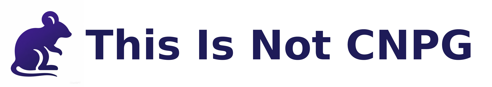

[](https://github.com/not-cloudnative-pg/)

# CNPG PostgreSQL Extensions Container Images

This repository provides **maintenance scripts** for building **immutable
container images** containing PostgreSQL extensions supported by
[CloudNativePG](https://cloudnative-pg.io/). These images are designed to
integrate seamlessly with the image volume extensions feature in CloudNativePG.

## Documentation

- [Adding a New Extension](./CONTRIBUTING_NEW_EXTENSION.md): A step-by-step
  guide for contributors.
- [Building Locally](./BUILD.md): Technical instructions for the build system
  (Dagger/Task).
- [CloudNativePG Documentation](https://cloudnative-pg.io/documentation/current/imagevolume_extensions/):
  How to use these images in your cluster.

---

## Requirements

- **CloudNativePG** ≥ 1.27
- **PostgreSQL** ≥ 18 (requires the `extension_control_path` feature)
- **Kubernetes** 1.33+ (with [ImageVolume feature enabled in 1.33 and 1.34](https://kubernetes.io/blog/2024/08/16/kubernetes-1-31-image-volume-source/))

---

## Supported Extensions

CloudNativePG actively maintains the following third-party extensions, provided
they are maintained by their respective authors and distributed as
Debian packages that comply with the Debian Free Software Guidelines (DFSG),
from a trusted, auditable repository
(see [Extension Requirements](#extension-requirements)).

| Extension | Description | Project URL | Maintained by |
| :--- | :--- | :--- | :--- |
| **[pgAudit](pgaudit)** | PostgreSQL audit extension | [github.com/pgaudit/pgaudit](https://github.com/pgaudit/pgaudit) | CNPG maintainers |
| **[pg_crash](pg-crash)** | **Disruptive** fault injection and chaos engineering extension | [github.com/cybertec-postgresql/pg_crash](https://github.com/cybertec-postgresql/pg_crash) | CNPG maintainers |
| **[pgvector](pgvector)** | Vector similarity search for PostgreSQL | [github.com/pgvector/pgvector](https://github.com/pgvector/pgvector) | CNPG maintainers |
| **[PostGIS](postgis)** | Geospatial database extension for PostgreSQL | [postgis.net/](https://postgis.net/) | CNPG maintainers |
| **[TimescaleDB Apache-2 Edition](timescaledb-oss)** | Time-series database for PostgreSQL (open source version) | [github.com/timescale/timescaledb/](https://github.com/timescale/timescaledb/) | @shusaan |
| **[wal2json](wal2json)** | Logical decoding output plugin for PostgreSQL | [github.com/eulerto/wal2json](https://github.com/eulerto/wal2json) | @solidDoWant |

> [!NOTE]
> PostGIS is licensed under GPL-2.0, which is not on the CNCF Allowlist. It
> predates this policy; the maintainers are filing a CNCF license exception
> for it. PostGIS is not a precedent for accepting further non-Allowlisted
> extensions.

Extensions are provided only for the OS versions already built by the
[`cloudnative-pg/postgres-containers`](https://github.com/cloudnative-pg/postgres-containers) project,
specifically Debian `stable` and `oldstable`.

---

## Contribution and Maintenance Policy

Contributors are welcome to propose and maintain additional extensions.

### Governance and Compliance

The project adheres to the following frameworks:

- **Governance Model:** complies with the CloudNativePG (CNPG) Governance
  Model, as defined in [`GOVERNANCE.md`](GOVERNANCE.md).
- **Code of Conduct:** follows the CNCF Code of Conduct, as defined in
  [`CODE_OF_CONDUCT.md`](CODE_OF_CONDUCT.md).

### Extension Requirements

When proposing a new extension, the following criteria must be met:

- **Licensing and IP ownership:** We redistribute unmodified third-party
  software as container images. Every component in an extension image must be
  covered by a license on the
  [CNCF Allowlist License Policy](https://github.com/cncf/foundation/blob/main/policies-guidance/allowed-third-party-license-policy.md),
  which includes Apache-2.0, MIT, and the PostgreSQL License. CNCF policy
  requires a formal exception for any component not covered by the Allowlist.
  Beyond the grandfathered PostGIS case, the maintainers do not intend to file
  further exception requests, so only Allowlisted components will be accepted
  for new extensions in this project.
  This is a governance decision, not a legal limitation; contributors whose
  extension cannot meet this requirement are welcome to adopt the same build
  tooling and distribute images independently.
- **Structure:** only one extension can be included within an extension folder.
- **Debian Packages:** Extension images must be built **exclusively** from
  Debian packages in the `main` component (which by definition complies with
  the [DFSG](https://www.debian.org/social_contract#guidelines)), sourced from
  a trusted, auditable repository.
  The [PostgreSQL Global Development Group (PGDG)](https://wiki.postgresql.org/wiki/Apt)
  is the recommended source, but other Debian repositories are acceptable
  provided they meet the same standards. This is a hard requirement for two
  reasons: (a) Debian DEP-5 machine-readable copyright files are the mechanism
  used to satisfy attribution obligations: they are copied into
  `/licenses/<pkg>/` in the final `FROM scratch` image at build time; (b)
  [DFSG](https://www.debian.org/social_contract#guidelines) compliance
  guarantees that non-free components have been removed by the package
  maintainers, ensuring license hygiene.
- **License inclusion:** all necessary license agreements for the extension and
  its dependencies must be included within the extension folder (refer to the
  examples in the `pgvector` and `postgis` folders).

See [Adding a New Extension](./CONTRIBUTING_NEW_EXTENSION.md) for the full
workflow on proposing and submitting a new extension.

### Submission Process

1. **Request and commitment:** Open a new issue requesting the extension.
   The contributor(s) must agree to become "component owners" and maintainers
   for that extension.
2. **Approval:** Maintainers review the proposal and either approve it or
   request changes.
3. **Submission:** Component owner(s) open a Pull Request (PR) to introduce
   the new extension. The PR must include an entry in the `CODEOWNERS` file
   adding the component owner(s) for the new extension folder. The PR is
   reviewed, approved, and merged.
4. **Naming:** The name of the extension is the registry name.

### Removal Policy

If component owners decide to stop maintaining their extension, and no other
contributors are found, the main project maintainers reserve the right to
**unconditionally remove that extension**.

---

## Naming & Tagging Convention

Each extension image tag follows this format:

```
<extension-name>:<ext_version>-<timestamp>-<pg_version>-<distro>
```

**Example:**
Building `pgvector` version `0.8.1` on PostgreSQL `18.0` for the `trixie`
distro, with build timestamp `202509101200`, results in:

```
pgvector:0.8.1-202509101200-18-trixie
```

For convenience, **rolling tags** should also be published:

```
pgvector:0.8.1-18-trixie
pgvector:0.8.1-18-trixie
```

This scheme ensures:

- Alignment with the upstream `postgres-containers` base images
- Explicit PostgreSQL and extension versioning
- Multi-distro support

---

## Image Labels

Each extension image includes OCI-compliant labels for runtime inspection
and tooling integration. These metadata fields enable CloudNativePG and
other tools to identify the base PostgreSQL version and OS distribution.

### CloudNativePG-Specific Labels

| Label                                 | Description                      | Example                                                 |
|:--------------------------------------|:---------------------------------|:--------------------------------------------------------|
| `io.cloudnativepg.image.base.name`    | Base PostgreSQL container image  | `ghcr.io/cloudnative-pg/postgresql:18-minimal-bookworm` |
| `io.cloudnativepg.image.base.pgmajor` | PostgreSQL major version         | `18`                                                    |
| `io.cloudnativepg.image.base.os`      | Operating system distribution    | `bookworm`                                              |
| `io.cloudnativepg.image.sql.version`  | PostgreSQL extension SQL version | `0.8.2`                                                 |

### Standard OCI Labels

In addition to CloudNativePG-specific labels, all images include standard OCI
annotations as defined by the [OCI Image Format Specification](https://github.com/opencontainers/image-spec/blob/main/annotations.md):

| Label                                  | Description                 |
|:---------------------------------------|:----------------------------|
| `org.opencontainers.image.created`     | Image creation timestamp    |
| `org.opencontainers.image.version`     | Extension's package version |
| `org.opencontainers.image.revision`    | Git commit SHA              |
| `org.opencontainers.image.title`       | Human-readable image title  |
| `org.opencontainers.image.description` | Image description           |
| `org.opencontainers.image.source`      | Source repository URL       |
| `org.opencontainers.image.licenses`    | License identifier          |

You can inspect these labels using container tools:

```bash
# Using docker buildx imagetools
docker buildx imagetools inspect <image> --raw | jq '.annotations'

# Using skopeo
skopeo inspect docker://<image> | jq '.Labels'
```

## Image catalogs

To simplify the deployment of PostgreSQL extensions, this project automatically
generates `ClusterImageCatalog` resources. These catalogs provide a curated
list of compatible extension images for PostgreSQL 18+ versions.

- **Frequency:** Built once a week.
- **Location:** Published in the [`artifacts`
  project](https://github.com/cloudnative-pg/artifacts/tree/main/image-catalogs-extensions).
- **Naming Convention:** These are based on the `minimal` catalog and use the
  `catalog-minimal` prefix (e.g., `catalog-minimal-trixie.yaml`).

